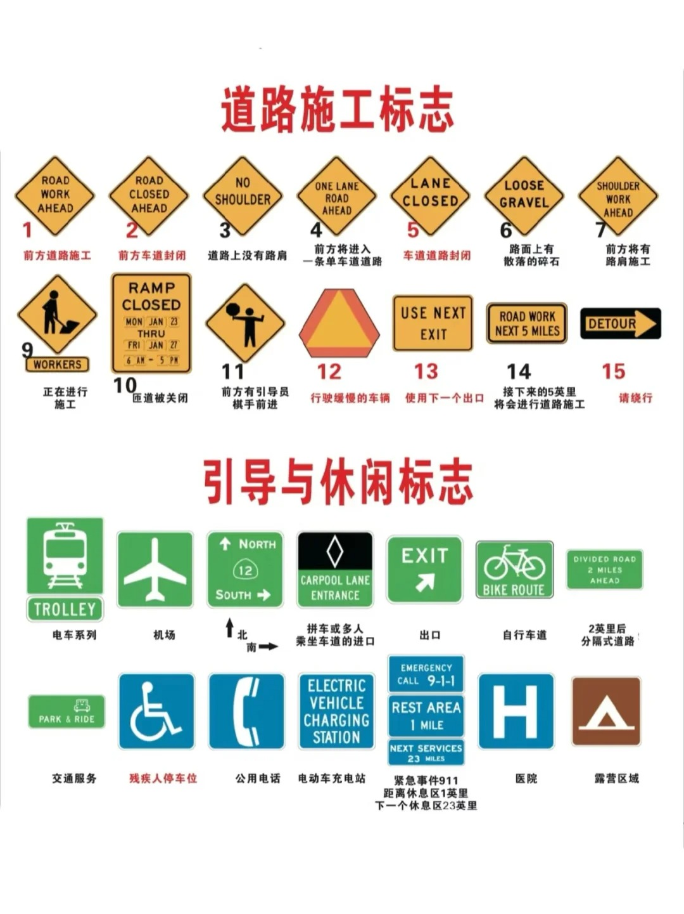

# DMV Practice Notes (Formatted)

> [!NOTE]
>

# P1

---

**小 tips：答案选项里有「安全」两个字基本上就选这个选项！！！**

1. <span style="color:red">路权：右边先走</span>

2. <span style="color:red">儿童：</span>6 岁以下儿童留在车内无人照顾是违法行为，无论是否开窗，只要没有 **12 岁以上** 的人监管就不行（动物也是一样要求）。
   合法：**12 岁以上随同**。

3. 没有人行横道和停车线：车辆停在**路口前**。

4. 容易结冰：**桥梁和立交桥路面**。

5. 路面最滑：刚开始下雨的**几分钟**。

6. <span style="color:red">红灯时，可以右转：除非有其他规定，在停车后</span>

7. 急转弯时，使用制动降低车速：在驶出弯道的所有时间。

8. 使用喇叭：
 
   在狭窄道路上行驶时，如前方视野不足 **200 英尺**，则应该鸣响喇叭。
 
   <span style="color:red">如果孩子要跑到马路上，你应该使用喇叭。</span>

9. 黄线分隔车道是：将**反方向行驶**的车道分开。

10. <span style="color:red">(只要是交叉路口) 交叉口、小巷、铁路、轻轨：时速 15 英里</span>

    商业区、学校、住宅：时速 **25 英里**。

11. **停车：**
    - 涂红色：不允许停车，但巴士除外，会有路标。
    - 涂黄色：仅供 [装卸货车] 或上下乘客。
    - 涂白色：只允许足够的时间接送乘客或取送邮件。
    - 涂蓝色：允许有特殊泊车牌或车牌照的残疾人停车。

12. **3 秒的缓冲距离**：被一位追尾者紧跟时。
    **3 秒原则**：避免追尾（被追尾者紧跟时）。
    <span style="color:red">5 秒：高速公路换道、驶出、驶入。</span>
    **10–15 秒**：为避免最后一分钟的行动，要看前方的路。

13. 大雾中行驶时，打开：前灯的**近光灯**。

14. 最流畅的车道：中间车道（**2 车道**）。

15. **5 辆车或更多**的车跟随时，要停车让其他车超过。

16. 盲交叉路口：车速 **15 英里**。（100,100）

17. 致命车祸中：**酒驾 60%** 。

18. <span style="color:red">一个校车是在分隔式公路或者有多条行车线的公路（每一方向有两个或多个行车线）的另一侧行驶，您则不必停车。</span>

19. 大型卡车刹车是一般汽车的：**2 倍**。

20. 安全气袋：坐在距离方向盘至少 **10 英寸** 的地方。

21. 在红灯时可以左转：从**单行道进入单行道**。

22. 只亮着停车灯开车：**任何情况下都不可以**。

23. <span style="color:red">如果夜间的对面来车亮着远光灯，您应当：向右线或道路的右边看。</span>

24. 如果没有限制线，应当将车停在：**转弯处**。

25. 一个橙色信号灯：**前方修筑道路**。

26. 在住宅区可以合法回转的情况是：**当附近没有车辆接近时**。

27. 在路口左转弯时，您**必须在转弯之前 200 英尺内汇入自行车道**。

28. 手势信号：
    - <span style="color:red">手臂向上：右转</span>
    - <span style="color:red">手臂水平：左转</span>
    - <span style="color:red">手臂向下：停车或者缓慢</span>

29. 两组实心双黄线相隔两英尺或者更多表示：一个障碍。切勿在该障碍区行驶或穿越该障碍区或者在该障碍区左转或回转，除非在该障碍区的指定开口处。

30. <span style="color:red">视线盲点：回头看</span>

31. 积雪路面：车速减半
    湿滑路面：速度降至 **5–10 mph**
    结冰路面：速度降至低于 **5 mph**

32. 在双车道上有特殊的道路标记：允许车辆通行。

33. 在 **55 英里**的速度下，车将行驶 **300 英尺** 才能停下，大型车要 **400 英尺**。

34. 后轮都比前轮路经更短。

35. 在以下血液酒精浓度（BAC）的情况下开车，则属于违法行为：
    - <span style="color:red">年满 21 岁：血液中酒精浓度达到 0.08% 或以上</span>
    - 未满 21 岁：血液中酒精浓度达到 **0.01%** 或以上
    - 在酒后驾驶监督期间：任何年龄的 **0.01%** 或以上
    - 如果驾驶的车辆需要商业驾驶执照，则为 **0.04%** 或更高

    酒精浓度过高，**可能处以多达 6 个月（半年）的监禁**。

36. 打滑：最重要的回收装置：**方向盘朝着打滑的方向**。

37. 未成年人不得在 **11:00 pm – 5:00 am** 驾驶。

38. 左转弯时，必须服从：**给任何人和迎面车辆上路**。

39. 自行车：超过自行车时留出 **3 英尺** / 明亮的绿色。

40. <span style="color:red">超车时要看到后面车：后视镜里的前灯。</span>

41. 上坡和下坡相遇：下坡车倒车上山，下坡车让路给上坡车，**上坡车有先行权**。

42. 必须发出讯号（打信号灯）：
    - 转弯、变道、减速或者停车时；
    - 转弯前至少要有 100 英尺；
    - 在高速公路上变换行车线的至少 **5 秒** 之前；
    - <span style="color:red">在靠向路缘或者驶离路缘之前；</span>
    - 在即将通过十字路口时；
    - <span style="color:red">即使在看到周围没有车的时候也要打灯。</span>

43. 不要在驶近的轻轨车正前方转弯。

44. 高速公路停车，你不应该：放下车窗。

45. <span style="color:red">未满 21 岁酒驾：暂停一年，1000 元罚款，扣押车 30 天。</span>

46. **使用远光灯：**
    - 附近没有迎面而来的车辆；
    - 不熟悉的路；
    - 施工区域；
    - 路边可能有人的地方（空旷的地方）；
    - <span style="color:red">空旷的乡间地区</span>。

    **使用近光灯：**
    - 雾、雪、大雨中不能使用远光灯；
    - <span style="color:red">日落后 30 分钟开始直至日出前 30 分钟。</span>

47. <span style="color:red">出售车辆：5 天通知 DMV。</span>

    购买车辆：**10 天** 将车辆所有权转至名下。

48. **斜坡泊车：**
    - 下坡：将车轮转向路边；
    - 上坡：将车轮转离路缘；
    - 无路缘：将车轮转向路肩。

49. 左、右转弯：观察 **左–右–左**，直至安全时转弯。

50. 在公共交通巴士的指定区域内驾驶、停车、暂时停放或停放车辆是违法的。必须有标志标示此道为“公共汽车专用”。
    但是，**可以穿过公共交通巴士行车线右转**。

51. 在交叉路口闪烁的红灯：**在进入前停车，然后在安全的情况下继续行驶。**
    闪烁的黄灯：放慢速度并保持警惕，**无需停车**。
    - 闪烁的黄灯：放慢速度并保持警惕，无需停车
    - 恒亮的黄灯：如果能够安全停车则停车，如果无法安全停车则小心穿过十字路口

52. <span style="color:red">在隧道内或者桥梁上泊车，有标志许可的情况可以。</span>

53. 大型车辆及卡车盲点：**如果看不到卡车的后视镜，卡车司机就看不到你**。

54. <span style="color:red">驾驶员需要与其他车辆、行人、使用自行车人员、公路人员及大型车辆共用道路。</span>

55. <span style="color:red">当巴士、有轨电车或者无轨电车停在安全区或者红绿灯处时，可用不超过 10 英里的时速通过。</span>

56. **处罚：**

- **逃逸：**
  <span style="color:red">(1) 如果加州司机因逃避执勤执法人员的追捕且未造成任何人身伤害而被定罪，可能面临最高可判处 1 年监禁。</span>
  (2) 在执法追捕过程中造成严重人身伤害的人员，将被判处最高 **七年** 的州监狱监禁，或一年或以下的县监狱监禁。
  (3) 因在追捕过程中逃避执法而被判犯有过失杀人罪的人将被关押在州监狱中至少 **4 至 10 年**。
  (4) 如该人在驾驶您的车辆时被发现，您的车辆可能被扣留 **30 天**。

- **动物：** 将动物遗留或者抛弃在公路上，处以最高 **1000 美金罚款** 或者 **6 个月监禁**，或者两者并罚。

- **施工区：** 违反施工区的交通法规可被罚款 **1000 美元** 或者以上。袭击修路工人最高罚款 **2000 美元**，以及最长一年的监禁（加倍处罚）。

- **校车没停车：** 可能被处以最高 **1000 美金** 的罚款，并且驾驶权可能被暂时吊销 **一年**。

- **拒绝血液或尿液检查：** 暂时取消或者吊销驾驶资格 **一年**。

57. 锁轮打滑是由：高速行驶时刹车用力过猛




---

# P2

<span style="color:red">任何时刻都要礼让行人</span>

1. 酒精浓度 BAC 及酒驾相关
    1️⃣ <span style="color:red">21 岁以上 - 0.08%</span>
    2️⃣ 21 岁以下 - 0.01%
    3️⃣ 在酒后驾驶监察期 - 0.01%
    4️⃣ 商业驾驶执照. 驾驶出租车 - 0.04%
    5️⃣ 酒精浓度过高，可能处以多达 **6 个月监禁**
    6️⃣ **未满 21 岁酒驾：暂停一年，1000 元罚款，扣押车 30 天**
    7️⃣ <span style="color:red">携带酒精在车上，容器必须没开过，放后尾箱就不违法</span>
    8️⃣ 如果你拒绝接受血液和尿液检测，DMV 将暂时取消或吊销你的驾照
    9️⃣ 如果你的年龄介于 13 到 20 岁，并因在酒精或药物的影响下驾驶自行车而被定罪，一旦你转为合资格驾车，你的驾驶权有可能被暂停或延期一年
    1️⃣0️⃣ 酒后驾驶会在机动车辆管理局的记录中保存 **10 年**

2. 路边停车：
    1️⃣ 白色：仅限足够时间停车，供乘客上下车或投送邮件使用
    2️⃣ 黄色：仅限乘客上下车或装卸货物时间
    3️⃣ 绿色：限制停车时间
    4️⃣ 红色：不能停车，**但 Bus 除外**
    5️⃣ 蓝色：允许有特殊泊车牌的残疾人停车

3. 灯
    1️⃣ 恒亮红灯：含义“停车”
    2️⃣ 红色箭头：含义“停车”
    3️⃣ <span style="color:red">闪烁红灯：含义“停车”，等同于 Stop sign，安全时可继续行进</span>
    4️⃣ <span style="color:red">恒亮黄灯：含义“小心”，能安全停车就停，不能停车就小心穿过十字路口</span>
    5️⃣ 黄色箭头：含义“受保护”
    6️⃣ <span style="color:red">闪烁黄灯：含义“谨慎驾驶”，无须停车</span>
    7️⃣ 闪烁黄色箭头：可以转弯，但不受其他车流保护
    8️⃣ 交通信号灯不运作，就像十字路口在各个方向都有 stop 标志控制一样停下来。在安全情况下小心继续行行
    9️⃣ 不可右转情况：有 no turn on red 标志；停在红色箭头灯处，你无法右转要等绿灯
    1️⃣0️⃣ <span style="color:red">谁先到 Stop sign 谁先走，同时到，右边先走</span>

4. 追捕罚款相关
    1️⃣ 若你逃避执勤执法人员的追捕且未造成任何人身伤害：最高可判处 **1 年监禁**
    2️⃣ 在执法追捕过程中造成严重人身伤害的人：判最高 **七年** 的州监狱监禁，或一年或以下的县监狱监禁
    3️⃣ <span style="color:red">因在追捕过程中逃避执法而被判犯有过失杀人罪：关押在州监狱中至少 4 至 10 年。</span>

5. 右转：
    手臂💪向上
    左转：手臂💪水平
    停车或者缓慢：手臂💪向下

6. 斜坡停车：
    1️⃣ <span style="color:red">无路缘时：上坡向左打轮，下坡向右打轮</span>
    2️⃣ 有路缘时：车轮需转向路缘，使车辆接触路缘后停下

7. 交叉口. 小巷. 铁路. 轻轨：时速 **15 mph**
   <span style="color:red">商业区. 学校. 住宅：时速 25 mph</span>

8. 3 秒：避免追尾
   5 秒：高速公路换道. 驶出和驶入
   10–15 秒：为避免最后一分钟的行动

9. 以下情况可以超过黄色双实线：
    1️⃣ 在左侧有指定入口的高载客量车辆专用道内行驶
    2️⃣ 当你所在一侧的行车线关闭或者有障碍时
    3️⃣ <span style="color:red">你可以穿过一组黄色线左转或进入或驶离行车线. 回转或是进入和驶离私人道路。</span>

10. 积雪路面：将速度降低一半
    湿滑路面：将速度降至 5 到 10 mph
    结冰路面：将速度降至低于 5 mph

11. <span style="color:red">出售车辆：5 天告知 DMV</span>
    购买车. 搬家. 车祸：10 天告知 DMV

12. 在路口右转弯时，你可在转弯之前 **200 英尺** 内汇入自行车车道

13. 大客车刹车是正常车的**两倍**

14. <span style="color:red">什么时候可以合法掉头：住宅区 200 英尺内没有行人或者车辆</span>

15. <span style="color:red">6 岁以下儿童留在车内没人照顾是违法行为，无论是否开窗，合法情况：12 岁以上陪同</span>

16. 可以穿过公共交通巴士行车线右转，但是在公共交通巴士行车线内驾驶. 停车等是违法

17. 如果夜间的对面来车亮着远光灯，你应当：**向右线或道路的右边看**

18. 急转弯时，使用制动降低车速，注意是在驶出弯道的所有时间

20. <span style="color:red">超车时要看到后面车：后视镜里的前灯</span>

21. 上坡和下坡相遇：**上坡车有先行权**

22. <span style="color:red">最容易结冰的地方：桥梁和立交桥路面</span>

23. 路面最滑时：刚开始下雨的几分钟

24. 你在中间左转行车线内行驶的距离不得超过 **200 米**

25. <span style="color:red">日落前后 30 分钟开车头灯</span>

26. <span style="color:red">撞车或卷入交通事故要提供：驾照. 保险证明. 车辆登记. 现居地址</span>

27. 当你在不安全的双行车线路上缓慢行驶，并且有**五辆或更多**车辆跟随你时，你必须使用岔道区域或行车线，让其他车辆通过

28. 驶出高速公路：在正确行车线时，在离开前 **5 秒** 大约 **400 米** 发出信号，驶离时不要超过任何实线

29. 五边形标志：学校附近
    四边梯形：警告前方有指定路况和危险
    白色长方形标志：你必须遵守的重要规则

30. 转弯时，其后轮的转弯路径径**小于**前轮

31. <span style="color:red">违反施工区的交通法规可能被罚 1000 $ 以上</span>

32. <span style="color:red">转弯前 100 尺打转向灯</span>

33. 安全气袋位于坐在距离方向盘至少 **10 英寸** 的地方

34. 什么时候在红灯时可以左转：**从单行道进入单行道**

35. 若驾照上显示需要佩戴眼镜进行开车，则必须佩戴眼镜，否则不可以上路

36. <span style="font-weight:bold">司机服用任何药物都不可以进行开车</span>

37. 成为加州居民 **10 天** 后可获得州驾驶执照

38. 如果没有张贴，双车道无分隔公路的最高速度限制：**55 mph**

39. 在任何山坡上停车时，使用驻车制动器并将车辆置于档位或“停车”状态

40. 没有人行道和行车线：**车停在路口处**  没有限制线，车停在：**转弯处**

41. 将动物遗留或者抛弃在公路：罚款 **1000 $，6 个月监禁**

42. 违反施工区交通法规：罚款 **1000 $ 以上**

43. 校车没停车：最高罚 **1000 美金**，并且驾驶权可能被暂时吊销一年

44. 八岁以下或身高不足 4.9 米的儿童将其固定在后排座椅上的儿童乘客约束装置。八岁以上或身高至少在 4.9 米以上的儿童可使用符合联邦标准的安全带并正确固定。

45. 系安全带是法律规定

46. 如果你需要减速或停车，而其他司机可能没预想，那你要怎么做：**轻踩刹车几次，让刹车灯闪烁**

47. 限位线：指示你在那里必须停车

48. 当你离前方车辆 **300 英尺以内** 或者对向来车在 **500 英尺以内**，必须切换回近光灯

49. <span style="color:red">雾天不能用远光灯</span>

50. 锁轮打滑：是高速行驶时刹车用力过猛

51. 那打滑了方向盘如何打：**朝着打滑的方向打**

52. 高速停车：**不要放下车窗**

53. <span style="color:red">桥上的路面会比其他路段更容易结冰</span>

54. 一个校车是在分隔式公路或者多条行车线的公路（每一方向有两个或多个行车线）的另一侧行驶，你则不必停车。（即同向靠近校车必须停，反向有隔离就不用停）

```
narrow: 狭窄
track: 轨道铁路
flooded: 被水淹的rough road: 起伏路
cross traffic ahead:  前方十字路口
Slide area: 砂石落下地带
falling area: 落石区
9% grade: 9%下坡道
railroad: 铁路
yield to uphill traffic: 礼让上坡交通
turnout: 避车道，路边的暂时加宽区域
one way:  单行道
loose gravel: 松土地带
ramp: 匝道
detour: 绕行
teolley: 电车
divided road: 把对向车流分开的标志
carpool lane: 拼车道，多人共乘车道
road construction ahead: 前方道路施工
passing line ahead:  前方可以超车
right lane must turn right: 最右边车道右转
flagman ahead: 旗手
interstate: 洲际高速公路
dead end notlet: 死胡同
curve: 是道路自然连续地弯曲，通常无需停车，但需要减速控制方向。
```

---

# P3 关键点

- 转弯前 100 尺，提前五秒钟
- 狭窄山路，视野不足 200 尺，按喇叭
- 迎面驶来不超过 500 尺、同向不超过 300 尺时，使用近光灯
- 只使用停车灯违法；在 1K 尺以外的地方使用车头灯；日落后 30 分钟至日出前 30 分钟开车头灯
- 黄色实线表示双向道的道路中心，如果只有一条线，不要超过前面车辆
- 自行车优先于车辆，共享的街道上骑车
- 左和右转前 200 尺注意自行车道，100 尺打转向灯
- 住宅区 200 尺以内掉头，如无车辆靠近
- 并车的时候，离开前 3 秒、400 尺之内发出讯号
- 离开高速公路前 5 秒、400 尺之内发出讯号
- 市区街道并线 150 尺，高速 300 尺
- 山丘、弯道、十字路口，距离三分之一处安全超车
- 十字路口、桥梁、隧道 100 尺内禁止超车

- 下坡转向路边向右，上坡转向路缘向左
- 白色：上下车使用或投递邮件，临时停用
- 蓝色：残疾人
- 黄色：乘客上下或装卸货物
- 红色：禁止停车
- 在残障人停车 3 尺内禁止停车；距离消防站或消防局 15 尺内禁止 🚫
- 红色 Yield 标志：减速并准备停车，随后让车辆、自行车和行人
- 在山路，上坡人有先行权，下坡让上坡
- 普通客车以 55 迈行驶，平均刹车距离 300 尺，大型车辆 400 尺
- 摩托车预留 3 秒跟车距离
- 在警车经过后，后方尾随 300 尺违法
- 慢性车辆标志：道路维修低于 25 迈
- 骑自行车未满 18 岁需佩戴头盔
- 无法变动行车线时，要与自行车保持至少 3 尺
- 经过施工地不需要停车，小心按正常速度行驶
- 违法施工区交通法规罚款 1K，袭击修路人士罚款 2K，最长 1 年监禁
- 学校 500 尺之内限速 25，部分限速 15 迈

- 校车红灯闪烁未停车，可能处以 1K 罚款、吊销 1 年驾照
- 盲点交叉路口限速 15 迈；小巷限速 15 迈；靠近铁路限速 15 迈；距离最近的轨道至少 15 尺
- 将动物遗弃在高速公路罚款 1K 或监禁 6 个月
- 试图逃逸判处 1 年监禁
- 造成严重伤害：7 年监禁
- 逃避执法过失杀人：4–10 年
- 至少提前 10 秒扫视车辆前方道路
- 在没有足够反应时间时，使用 3 秒原则跟车
- 树木或建筑物结冰最早，化冰最晚
- 打滑、潮湿路段：降速 5–10 mph
- 积雪路段：降速一半
- 结冰路段：降至低于 5 mph
- 大雾浓烟开近光灯；刚刚开始下雨开近光灯
- 满 21 岁酒精含量超过 0.08% 违法
- 超过 1K 的财产损失，10 天之内向 DMV 报告
- 出售车 5 天内通知 DMV，购买车 10 天时间内办理

- 校车红灯闪烁：相同方向的车要停下来，如果同向车道多，不用（指远离校车一侧）；反方向不用
- 两边都是单行道，红灯可以左转
- 双白实线用来分隔正常道路和优先道路
- 不能把低于 6 岁的儿童单独留在车里，除非有一个 12 岁以上的人陪同
- 手臂伸直左转，向上右转，向下停车减速
- 对面开车远光灯时，尽量靠右
- 交通事故需提供：驾照、保险、车辆登记、现居地址
- 倒车看盲区，可以单手开车
- 黄色实线：对面车道
- 体重 55 磅、5 岁儿童要求儿童座椅
- 司机与方向盘 10 英寸距离
- 大卡车刹车是普通车 2 倍以上的距离
- 人行横道前停车等待
- 身后超过 5 台车时应让行

---

# P4 加州 DMV 笔试真题 + 题库 | 23 秋

1. 刚开始下雨的时候，路最滑。
2. 小巷（Alley）铁路口（uncontrolled railroad crossing）限速 **15 mph**。
3. 道路施工（construction）的标识牌是橙底黑字。
4. 倒车、变道进入高速的时候都需要**回头看盲点**（look over your shoulder），不能只看后视镜。
5. 路边的颜色：蓝色（残疾人专用车位）；红色（禁止停车）；黄色（临时上下客，不可超过规定限时）；白色（一般路沿，临时上下车，不可久停）；绿色（限时停车，看周围指示牌）。
6. 在买卖车辆之后的 **5 天** 内，需要通知 DMV。
7. 最先容易结冰的路段是：**A. 桥和 overpasses ✅；B. Tunnels；C. Intersections**。
8. 前方铁道
9. 附近学校
10. 不可超车
11. 低速车辆
12. 拥有驾照是：A. right；**B. privilege ✅**；C. requirement。
13. 开车戴耳机，不仅危险，而且违法。
14. 任何情况下，如果有可能阻碍 intersection 的交通，则不能开入。
15. 自行车在左转的时候可以占用左边车道。
16. 自行车可以占用摩托车道。
17. 离开 interstate 道路时，应该在进入减速道（deceleration lane）之时开始减速，不要提前减速。
18. 不要开得比车流慢，最好保持和车流一样的速度。
19. 行人永远有路权（right-of-way）。
20. 高速（Freeway）上变道不要减速。
21. 日落后半小时之后、日出前半小时之前需要开车灯。
22. **Basic Speed Law**：不要比当前的安全速度更快。
23. 撞到别人停着的车之后要：**leave a note**，留下联系方式。
24. 遇到校车有红灯并展示 stop sign，必须停下并等校车收回 stop sign 并继续向前开之后，才能继续开。否则最高罚款 **1000 刀**。
25. 在施工区域内产生的罚款会翻倍。
26. 必须停车的情形：红灯、闪烁的红灯（等效 stop sign）、没有亮的信号灯（blacked out）。在黄灯时，如果能安全停车，则需要停车。**闪烁的黄灯：减速慢行，小心通过**。
27. 如果发生车祸并有人受伤，必须在 **10 天** 内通知 DMV。
28. 如果打滑（skid）或者爆胎，不应该猛踩刹车。
29. 如果在高速上经常被右边超车，则应该适时向右并线（右边是慢速车道）。
30. 要在右转之前的 **200 feet** 之内占用自行车道。
31. 超车后需要通过后视镜看到后车的 **两个车灯** 之后才能返回原来车道。
32. 六岁儿童必须要有 **12 岁以上人员陪同**，否则不能单独留在车里。
33. 在转弯之前必须提前 **100 feet** 打转向灯示意。
34. 前方右侧有车流汇入时，最好向左变道让出空间（不是减速让出空间）。
35. 在 interstate 道路需要紧急停车时：车靠边，打双闪，留在车里不要出来（这与国内不同；国内应车靠边、人撤离）。
36. 需要安全座椅的儿童：**8 岁以下或身高不足 4 feet 8 inches**。
37. 没有禁止停车标识时，可以不挡道地在自行车道停车。
38. Rearview mirror：车内前方正中间的后视镜；Side mirrors：车左右的后视镜。
39. 后车尾随（tailgate）较近时，应该增加自己与前车的距离，并在安全的时候驶入旁边车道。
40. 左右两辆车同时到达全向 stop sign 的路口时，**右边的车有路权**。
41. 永远不可以 drive off road 超车。
42. 在美国，**21 岁之下滴酒不沾**。
43. 在被超车时，需要保持匀速，不要加速。
44. 雾中驾驶，打开**近光灯（low beams）**，而不是只开雾灯（fog lights only）。
45. 很多药物如感冒药，以及酒精，都会损伤人的判断力。
46. Neutral = 空挡；White Cane = 视障人士专用的白色手杖（不要鸣笛）。
47. 潮湿易滑路面限速：**5–10 mph**；积雪路面：**速度减半**；结冰路面：**慢到爬（Slow to a crawl）**。

```
## 缩写

- HOV - High Occupancy Vehicle（车内多人）
- FWY - Freeway（高速公路）
- XING - Crossing（行人横穿道路）
- XWALK - Crosswalk（人行横道）
- RR - Railroad（铁路）
- ETC - Electronic Toll Collection（电子收费系统）
- Carpool or Diamond Lane - 专用于多人共乘的车辆通行的车道（摩托车和有证低排量车也可以通行）
- STOP - 停车让行
- Yield - 让行
- DUI - Driving Under the Influence（酒驾）

## 灯光类

- Headlights - 前灯
- High beam headlights - 远光灯
- Low beam headlights - 近光灯
- Fog lights - 雾灯
- Brake lights - 刹车灯
- Turn signals - 转向灯
- Hazard lights - 危险警示灯

## 驾驶控制类

- Steering wheel - 方向盘
- Accelerator pedal - 油门踏板
- Brake pedal - 刹车踏板
- Clutch pedal - 离合器踏板
- Gear shift - 换挡
- Parking brake - 驻车刹车
- Cruise control - 定速巡航
- Horn - 喇叭

## 安全类

- Seat belt - 安全带
- Airbag - 气囊
- Antilock Braking System (ABS) - 防抱死制动系统
- Blind spot - 盲点
- Backup camera - 倒车摄像头
- Parking sensors - 倒车雷达

## 车身类

- Doors - 车门
- Windows - 车窗
- Mirrors - 后视镜
- Bumper - 保险杠
- Hood - 引擎盖
- Trunk - 后备箱
- License plate - 车牌
- Windshield - 挡风玻璃

## 发动机与传动类

- Engine - 发动机
- Transmission - 变速器
- Clutch - 离合器
- Axle shaft - 驱动轴
- Exhaust system - 排气系统
- Fuel system - 燃油系统
- Radiator - 散热器
- Spark plug - 火花塞

## 仪表与控制类

- Dashboard - 仪表盘
- Speedometer - 速度表
- Fuel gauge - 油量表
- Temperature gauge - 温度表
- Indicator lights - 指示灯
- Ignition key - 点火钥匙
- Wiper blade - 雨刷片

## 其他类

- Air conditioning system - 空调系统
- Audio system - 音响系统
- Navigation system - 导航系统
- Battery - 电池
- Tires - 轮胎
- Suspension system - 悬挂系统
- Fuel tank - 燃油箱
- Electrical system - 电气系统
```

---

# P5 加州驾考笔试易错题 | 2024

1. One way：单行道，车流靠右行驶
2. 驶入或驶出私人车道时，可以跨越路面上的双黄实线

3. 限速相关：
   - 盲（blind）路口，限速 **15 英里/小时**
   - 校区附近形式并且在附近看到儿童时，除非有更低的限速标识，否则你的时速不得超过 **25 miles/h**
   - 商业区驾驶限速：**25 miles/h**
   - 住宅区行驶限速：**25 miles/h**
   - 如果一条公路限速是 **55 英里/小时**，当道路潮湿时你应该以什么速度行驶：以低于限速 **5–10 英里/小时** 的速度行驶
   - 前方路口没有信号灯，而且看不到两侧方向有驶近的车辆，应该以什么车速通过：**每小时 15 英里**

4. 远光灯的使用：只要安全合法，任何情况下都可以使用远光灯

5. 雨天路面湿滑，应该注意什么：尽量不要急转弯和急刹车

6. 如果一定要在公路上停车，应该遵守什么原则：
   - 将车停在离开路面的位置上（✅）
   - 停车位置的前方 200 英尺内不能有任何遮挡视线的障碍物（❌）

7. 多人共乘专用车道用菱形标记表示，什么情况下你可以使用：当车内所载乘客数达到专用车道标志上所标明的最低人数即可

8. 路面上单线的黄色实线表示什么：将相反方向的车道分开

9. 关于大型卡车及公共汽车的盲点描述：如果你不能完整地看见大型车辆的反光镜的正面，那么大型车辆的司机就有可能看不到你

10. 什么情况下你的车速可以超过时速 65 英里：在高速公路上

11. 什么情况下你可以在涂成白色的路边石旁停车：如果只是让乘客上下车或短时间内取送邮件
    - 涂上红色表示：不能停车，除非是公交车
    - 涂上黄色：仅供装卸货物或者搭乘乘客时使用
    - 蓝色：该路段禁止停车，除非司机是残障人士或持有特定的停车许可证

12. 根据加州车辆管理局统计，在所有致命车祸中，涉及酒后驾驶司机的大约占比多少：**60%**

13. 在有路牌标识的路口停车时，车子应该停在那里：在人行横道前

14. 在校巴的红灯闪烁期间，所有车辆必须一直停车等待

15. 驾车来到路口，发现红色信号灯一直在闪烁，表示：进入路口前要停车，确认安全后再继续行驶

16. 驶入铁道道口时，看见道口的信号灯正在闪烁，应该：停车等候，直到信号灯熄灭后再继续行驶

17. 出于安全驾驶的考虑，司机在行驶中应该注意瞭望前方多远的路况：当前车速下，**10–15 s** 的行车距离

18. 如果你被警察抓到从车内乱扔垃圾而受罚，这一污点是否会计入你的驾驶档案：会，不管你多大年龄

19. 一辆时速 55 英里大卡车在刹车时所需的距离是普通车辆的多少倍：**2 倍**

20. 如果你在高速公路上最左边的车道上以低于其他车流的速度行驶，将导致：会激怒其他的驾驶者 😊

21. 车祸发生的瞬间，方向盘部分弹出的安全气囊有可能对司机造成伤害，因此正确的做法是：司机和方向盘之间应该有 **10 英寸** 的距离

22. 哪些儿童要求使用儿童安全座椅：体重 **55 磅** 的 **5 岁** 儿童

23. 什么情况下你可以在红灯时右转弯：
    - 停车，查看交通状况并确信安全之后（✅）
    - 减速，查看交通状况并确信安全之后（❌）

24. 交叉路口，红色信号灯不停闪烁，表示：先停车观察路口的车流，确认安全后继续穿过路口

25. 如果警察认定你驾驶时血液中酒精浓度（BAC）过高，等待你的处罚是：最高可达 **6 个月** 的监禁；也可能会处以罚款

26. 哪种情况下，你必须在 **5 天** 内通知机动车辆管理局：你卖掉或转让了自己的车

27. 发生哪种情況时，你必须报警并向机动车辆管理局（DMV）提交书面报告：你卷入了一场交通事故，且事故中有人伤亡
    - 另一种问法：向谁提交书面报告：机动车辆管理局（DMV）

28. 橙黄色三角形标识：挂有这种标识的机动车是慢性车辆

29. 什么情况下你可以在红灯时左转弯：从**单行车道**进入另外的**单行车道**时

30. 如果有两组双黄实线且他们之间的距离至少有 2 英尺宽，表示什么：对司机而言，这样的两组双黄实线等同于不可逾越的墙壁

31. 如果警察以酒后驾驶的名义拘捕你，而你拒绝接受血液酒精浓度测试，后果是：驾照执照将被吊销至少 **一年**

32. 如何为紧急车辆让路：
    - 尽可能将车靠近道路右侧并停车（✅）
    - 立即减速，直到紧急车辆通过（❌）

33. 年满 21 周岁的驾驶者被查出血液酒精浓度 BAC 达到多少，会面临违法的指控：**0.08%**

34. 什么情况下你会被罚款 **1000 美元** 并处以 **6 个月监禁**：将动物遗弃在公路上

35. 当遇到大雾或沙尘天气时，应该如何应对：最好暂时不要开车了，等天气好转再说 😊

36. 想一下，分离的车道即将在前方汇合，是啥标志：**合流标志**

37. 在哪种情况下，你应该反复踩刹车来让刹车灯闪烁或者打开紧急信号灯（双闪灯）：你想要警告其他司机前方不远处发生了交通事故

38. 想一下，安全区的标志是怎么样的。是方便乘客上下公交车或有轨电车时使用的特殊区域，在什么情况下你才可以驾驶穿越安全区：**作为司机你不得在任何时候以任何理由驾驶车穿越安全区**

39. 什么情况下，警察会因为在你的车内发现已经打开瓶盖的酒精饮料而对你进行处罚：你的酒精饮料不是放置在车的后备箱内的时候

40. 途径车祸现场并想停下来救援，你应该在何处停车：先驶过车祸现场，再找合适的地方停车

41. 如果你卷入了交通事故，你必须和对方司机交换驾照信息，还要：提供你的保险证明、车辆登记证书和目前的住址

42. 哪一个是正确的：千万不要一厢情愿地认为其他司机会给你让路 😊

43. 如果路口处没有人行横道或者停车线，遇到红灯时该如何停车：在路口前停下车即可

44. 什么情况下才可以在小型卡车（如皮卡）的车斗中做人：车斗内配有供乘客使用的安全座椅和安全带

45. 刚刚超过一辆车后，什么情况下回到原来的车道是安全的：从后视镜中完整地看到被超车辆的两盏前车灯后

46. 超车时不能跨越道路中间的双黄色实线  

---

# P6


- 校车红灯闪烁未停车 1000 罚款吊销 1 年驾照
- 盲点交叉路口限速 15 迈小巷限速 15 迈靠近铁路线限速 15 迈 距离最近的轨道至少 15 尺
- 将动物遗弃在高速公路罚款 1000 或监禁 6 个月
- 试图逃逸判处 1 年监禁
- 造成严重重伤 7 年监禁
- 逃避执法过失杀人 4–10 年
- 至少提前 10 秒扫视车辆前方道路
- 在没有足够的反应时间使用三秒跟车
- 树木或建筑物结冰最早
- 潮湿路段 降速 5–10 mph
- 积雪路段 降速一半
- 结冰路段 降至 5 mph
- 大雾浓烟开近光灯 刚刚开始下雨开近光灯
- 满 21 岁酒精含量超过 0.08% 以上违法
- 超过 1K 的财产损失 10 天之内向 DMV 报告
- 出售车 5 天内通知 DMV 购买车 10 天时间
- 校车红灯闪烁相同方向的车要停下来如果同方向车道多不用反方向不用
- 两边都是单行道红灯可以左转
- 双白实线用来分隔正常道路和优先道路
- 不能把低于 6 岁的儿童单独留在车里 除非有一个 12 岁以上的人陪同
- 手臂伸直左转 向上右转向下停车减速
- 对面车开远光灯尽量靠右
- 交通事故提供驾照保险车辆登记现居地址
- 倒车看盲区单手
- 开车黄色实线对面车道
- 司机与方向盘 10 英寸距离
- 大卡车刹车是普通车 2 倍以上的距离
- 人行横道前停等等待身后超过 5 台车让行
- 转弯前 100 尺 提前五秒钟
- 狭窄山路 视野不足 200 尺按喇叭
- 迎面驶来不超过 500 尺使用近光灯
- 日落前后 30 分钟开头灯
- 自行车车道 100 尺打转向灯
- 住宅区 200 尺以内掉头如无车辆靠近
- 并车的时候离开前 3 秒 400 尺之内发出讯号
- 离开高速公路前五秒 400 尺发出讯号
- 下坡转向路边向右 上坡转向路缘向左
- 白色上下车使用或投递邮件临时停用
- 蓝色残疾人
- 黄色乘客上装卸货物
- 红色禁止停车
- 在残障人停车 3 尺内禁止停车 距离消防站或消防局 15 尺内禁止
- 红色 Yield 标志减速并准备停车随时让车辆、自行车和行人
- 在山路 上坡人有先行权 下坡让上坡
- 普通客车以 55 迈行驶平均刹车距离 300 尺 大型车辆 400 尺
- 摩托车预留三秒跟车距离
- 在警车经过在后方尾随 300 尺违法
- 慢行车辆标志道路维修低于 25 迈
- 骑自行车未满 18 岁佩戴头盔
- 无法变动行车线要与自行车保持至少 3 尺
- 经过施工地不需要停车小心按正常速度行驶
- 违法施工区交通法视罚款 1K 袭击修路人士罚款 2K，最长 1 年监禁
- 学校 500 尺之内限速 25，部分限速 15 迈

# P7

065.在四車道高速公路上以同一方向行駛時，大型卡車必須在哪個車道上行駛？
- [x] <span style="color: green;">靠近最右側的兩條車道</span>
- [ ] 除最左側（快速）車道外的任何車道
- [ ] 兩個中間車道，駛出高速公路時除外

139.如果你是第一個在車禍現場停車提供救助的人，你應該在以下地點駛離路面：
- [x] <span style="color: green;">在你經過車禍現場後</span>
- [ ] 在車禍現場的旁邊
- [ ] 在車道的邊緣附近，這樣可使你後面的車輛減速


# P8 Misc


1. 什么时候小孩和动物可以留在热的车上：never
2. 小孩什么时候可以在车上：有12岁以上监督
3. 什么时候开车头灯：日出前日落后30分钟
4. 行人永远有先行权
5. 路标记住
6. 高速公路丢动物：罚款1000监禁6个月
7. 满21岁酒精0.08%
8. 撞车后要通知谁：dmv
9. 手势：手臂伸直左转 向上右转 向下停车减速
10. 学校商业区居住楼限速25英里
11. 对方开远光灯尽量靠右
12. 有交通事故要提供的：驾照，保险，车辆登记，现居住址
13. 没有交通信号灯：让行先到路口的车辆和行人 同时到右边先走 （right has the right）
14. 黄色实线表示对向车道
15. 大雾打近光灯
16. 什么时候可以开远光：选乡野宽阔道路
17. 什么情况下红灯可以右转：考了2道题 记住 红色指示箭头不可以转，保证安全没有车才可以
18. 斜坡停车 车轮朝路边
19. 什么时候可以单手开：倒车 （需要看后面的盲区）
20. 肇事逃逸无伤害：罚1000

Rearview mirror 车内前方正中间的后视镜，side mirrors 车左右的后视镜

7. You are under 18 years of age and have had your license for eight months. You may drive:

- [ ] At any time.
- [x] Between 5 a.m. and 11 p.m.【记忆】
- [ ] Between 7 a.m. and 8 p.m. 

6. When is parking in a crosshatched (diagonal lines) area allowed? 在划有斜线标记的区域何时允许停车？

- [x] It is never allowed to park in a crosshatched (diagonal lines) area.
- [ ] If the area is at least twenty feet away from a railroad track.
- [ ] If the area is labeled as a bicycle lane, unless otherwise posted.